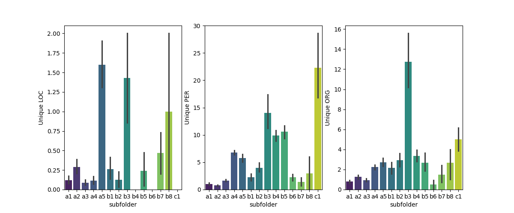
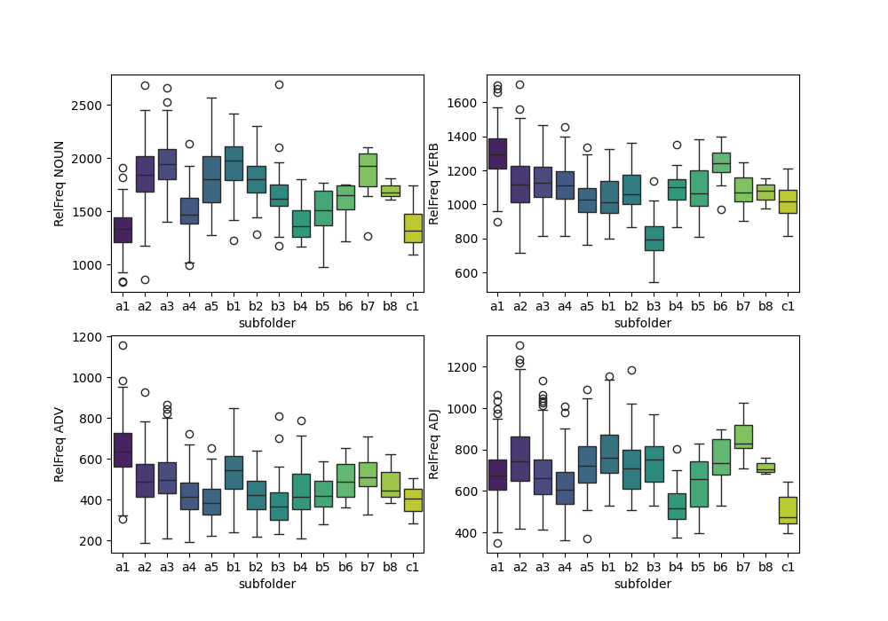

```{=latex}
\begin{center}
```
\ 

# Assignment 1

# Extracting Linguistic Features Using spaCy

\
*Date: 23/02/2024*

Laura Givskov Rahbek 
```{=latex}
\end{center}
```
\

## Description 

This folder contains assignment 1 for Language Analytics. The objective of the assignment is to work with input data arranged hierarchically in folders, to use ```spaCy``` to extract information from text data, and to save results and outputs in a clear and understandable way. More specifically the analysis aims to extract relevant textual features from the english essays used (see Data section), and investigate whether these can capture differences in the texts. The four parts of speech (POS) adjectives, adverbs, verbs and nouns will be extracted using POS tagging, and the number of unique locations, persons and organizations will be extracted using named entity recognition (NER). The folder contains two scripts, each described below; 

The ```feature_extraction.py``` script does the folllowing: 

- Loads an English language ```spaCy``` model, the default being ```en_core_web_md```.  

- Goes through each text in each of the subfolders in the ```in``` folder, for every text:   

  - The meta data is removed   

  - The relavtive frequency per 10,000 words of the four POS; nouns, verbs, adjectives and adverbs are found 

  - The number og unique persons, locations and organisations are identified using NER 

  - The POS frequencies and NEs are saved in a row in a .csv file, named according to the given subfolder, placed in the ```out``` folder.

The ```plot_features.py``` script does the following: 

- Loads in the .csv files with the extracted features from the ```out``` folder and adds three columns;  

  - subfolder: the name of the subfolder, indicating which specific essay prompt the text was written from.  

  - term: a, b or c, indicating whether the essay was written in term 1, 2 or 3.  

  - type: in the documentation for the corpus, the subfolders all belong to one of the following categories (in terms of type of text); Evaluation, Argumentation, Discussion, Linguistics, Literature and Culture.  

- Saves plots four plots in the ```out``` folder:  

  - A plot with four boxplots, one for each POS included. In all four the the 14 essay prompts (or subfolders) are on the x-axis and the relative frequency of the given POS is on the y-axis.   

  - A plot with three bar plots, one for each of the three NEs; persons, locations and organisations, count is on the y-axis and the 14 essay prompts on the x-axis.  

  - A pairplot visualising the correlations between the four POS included, coloured by the 14 essay prompts. 

  - A second pairplot, but here the distributions are coloured by the text type; Evaluation, Argumentation, Discussion, Linguistics, Literature and Culture.  
 
## Data

The data used is the *The Uppsala Student English Corpus* (USE), which is a collection of essays in English written by Swedish university students. The data can be accesed at [this link](https://ota.bodleian.ox.ac.uk/repository/xmlui/handle/20.500.12024/2457), where additional information on the corpus can be found too. 

The subfolders reflect the term the essay was written in, subfolder starting with *a* was written in the first term, *b* in the second and *c* in the third. Further each subfolder in the three categories represent a specific essay prompt, and belong to one of the six types of essays; Evaluation, Argumentation, Discussion, Linguistics, Literature or Culture.   

## Usage and Reproducing of Analysis

To reproduce the analysis:   

- Download and unzip the ```USEcoprus``` folder from the link above, and place it in the ```in``` folder.  

- Run the bash script ```setup.sh``` in the terminal, it creates a virtual environment and installs packages and dependencies in to it: 

  ```bash
  bash setup.sh
  ```

- Then, run the bash script ```run.sh``` in the terminal, this opens the virtual environment  and runs both scripts in the ```src``` folder, and then exits the virtual environment when finished.  

  ```bash
  bash run.sh
  ```

- It is possible to use another one of ```spaCy```s english language models, than the default ( ```en_core_web_md```). To use either ```en_core_web_sm``` or ```en_core_web_lg```, pass the flag -m (*model*) in the terminal and the chosen model, for example;   

  ```bash 
  bash run.sh -m en_core_web_sm
  ```  

## Discussion 

Before discussing the potential tendencies found in the visualization of the features extracted from the *USE corpus*, several limitations to this method are worth mentioning. First, ```en_core_web_md``` was trained on web data, (blogs, news, comments etc., [see the documentation for more](https://github.com/explosion/spacy-models)). Which is not the same type of text it is used on in this assignment. Word use, phrasing and the themes of the texts are very different to general web text, which might introduce some issues or a loss of information. Apart from these limitations, there are also general limitations in assesing the potential differences in the essays: the essays are of varying length, and the different subfolders contain a different number of essays, meaning differences in variance when evaluating the different variables. 
\

```{=latex}
\begin{center}
```
***Named Entity Recognition Plot***  


```{=latex}
\end{center}
```  

With that, I will discuss tendencies found in the plots. First the Named Entity Recognition plot, the first thing that stands out are the subfolders with much higher means than the rest. Specifically across all three NEs (location, persons and organisations) the following subfolders have high means in some or all of named enteties; ```a5```, ```b3```, ```b4```, ```b5```,  ```b8``` and ```c1```.  However, for ```b8``` the errorbar reveals high variance, in this case due to only three texts in this category. Different aspects sets the remaining three subfolders apart from the rest, ```a5``` and ```b3``` are the only subfolders in their respective text-type categories, Culture and Linguistics. ```c1``` contains Literature essays, along with other subfolders, but is the only written in the third term. Additionally, in the prompts for ```b3```, ```b4``` and ```b5```, the students had to include refrences in the essays, which can help explain the higher values in number of unique persons in these groups.    
\

```{=latex}
\begin{center}
```
***Parts of Speech Plots (per Subfolder)***

{height=235 width=auto} {height=235 width=auto}
```{=latex}
\end{center}
```

To be able to inspect the relative frequency of the four POS included, three plots were made. First, a boxplot as seen below to the left, and a pairplot to the right, both visualizing the distributions of relative frequencies for the four POS, per each of the fourteen essay prompts. First the pairplot grouped by subfolder indicates a couple of things, there seems to be a vague negative correlation between relative frequency of nouns and verbs, as well as between verbs and adjective and nouns and adverbs. These tendencies are then matched with positive correlation between verbs and adverbs and nouns and adjectives. These correlations seem to conform to the expectations of word use (verbs go with adverbs and nouns go with adjectives). In terms of differences between the 14 essays prompts it is difficult to distinguish much aside from the diagonal distributions seem to reveal that the distributions of ```a1``` are distinct to the rest for relative frequency of nouns and verbs. Looking at the boxplot makes this easier to see: ```a1``` has a lower frequency of nouns and a higher of verbs compared to many of the others. Further, ```b3``` has a lower relative frequency of verbs. Because of the many different subfolders, or groups, in the data, it is difficult to find clusters or tendencies. Therefore, the last plot that was inspected was the pairplot grouped by text-type.   
\
\
\
\
\
\
\
\
\
\
\
\
\
\
\

```{=latex}
\begin{center}
```
***Parts of Speech Plot (per Text Type)***

{height=300 width=auto}
```{=latex}
\end{center}
```

The most obvious distnictions can be found in the distribution showing relative frequency of nouns. Here, Discussion and Argumentation essays seem to be part of the same distribution (overlapping) and Evalutation and Literature essays seem to be part part of the same distribution. When looking at the distribution of relative frequency of adverbs, Argumentaion and Discussion essays are again overlapping, but Evaluation and Literature essays are distinct from each other. Across the visualizations there seems to be some tendencies unique to some of the essay prompts and text types, however to properly evaluate whether these tendencies are signficant to the individual groupings, further analysis would have to take place.   

\
\
*```codecarbon``` was used to track the environmental impact when running this code, the results and an exploration of this can be found in the ```Assignment-5``` folder in the repository.*
