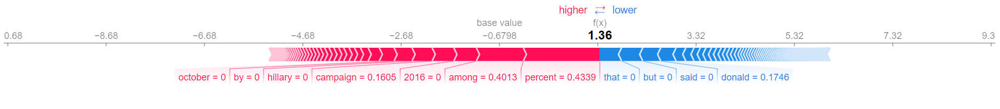

```{=latex}
\begin{center}
```
\ 

# Assignment 2

# Text Classification Benchmarks

\
*Date: 07-03-2024*

Laura Givskov Rahbek 
```{=latex}
\end{center}
```
\

## Description 

This folder contains assignment 2 for Language Analytics. The objective of the assignment is to train benchmark machine learning classifiers on structured text data, using ```scikit-learn```, make and save understandable outputs and models, and save the results in clear ways. More specifically, a ```TfidfVectorizer``` will be used to vectorize and extract features from the *Fake or Real News* dataset (more in the Data section below), these features will be used in training two binary classification models to classify news articles as either 'REAL' or 'FAKE', namely the ```LogisticRegression``` classifier and the ```MLPClassifier```. For both classifiers gridsearch will be implemented to identify the paramter values that leads to the best performing model. ```GridSearchCV``` will be used to implement this, in addition to implementing a five-fold cross validation in training. For both classifiers it can be specified which metric the model should be tuned for. Three scripts were made for this assignment, one which preprocessed and vectorised the data and one script for each of the two classifiers used. The three are describe below: 

The ```vectorizer.py``` script does the following:  

- Loads and splits the data into a test and train set.   

- Defines and saves a ```TfidfVectorizer``` to the ```models``` folder, the following parameters are defined:  

  - ngram_range = (1,2), allowing for both single words and up to two-word combinations in the features.  

  - lowercase = True, making all characters lowercase.  

  - max_features = 500, the top 500 features are used.  

  - max_df = 0.95 and min_df = 0.05, the five percent most and least frequent are ignored. 

- Fits and vectorises the training data, vectroizes the test data, then saves the extracted features to the ```out``` folder.  

Both classifier scripts: first, loads the vectorised features saved in the ```out``` folder. And lastly, evaluates the performance of the model on the test data and saves the evaluation metrics to the ```out``` folder, besides the classification report, the parameters used in the estimator can also be viewed in this file. The ```MLP_classifier.py``` also saves a plot of the training loss and validation accuracy. 

After loading in the data the ```LR_classifier.py``` script defines and fits a ```LogisticRegression``` classifier to the training data. Whether or not gridsearch is implemented: ```max_iter``` = 1000 and ```random_state``` = 42, and the final fitted model is saved to the ```models``` folder. The parameter used are described below:   

- If gridsearch is not implemented all paremeters are kept at their default values, available at the [documentation](https://scikit-learn.org/stable/modules/generated/sklearn.linear_model.LogisticRegression.html).  

- If gridsearch is implemented, ```solver```, ```penalty```, ```C``` and ```tol``` are tuned, the remaining parameters are kept at their default values.  

  -  ```solver``` defines the optimization algorithm.'lbfgs', 'saga' and 'liblinear were included; 'lbfgs' is robust and the default solver, 'liblinear' is recommended on smaller datasets, and 'saga' is overall well performing.  

  - ```penalty``` determines the regularization technique implemented, helping to balance between model fit and complexity. Different penalties are available for different solvers, leading to choosing 'l1', 'l2' and None.   

  - ```C``` defines the strength of regularization, the larger the value the less regulated the model is. The default is 1.0, additionally 0.1 and 0.01 are included.  

  - ```tol``` defines the threshold for when the model should stop training, the default is 0.0001, 0.00001 and 0.001 are included as well.   

After loading in the data the ```MLP_classifier.py``` script defines and fits a ```MLPClassifier``` to the training data. Whether or not gridsearch is implemented; ```solver``` = 'adam', ```max_iter``` = 1000, ```random_state``` = 42 and ```early_stopping``` = True (10% of the training data is used in validation, and the model stops training when the accuracy on the validation set does not increase by ```tol``` for 10 epochs), and the fitted model is saved to the ```models``` folder.  The parameters are described below:  

- If gridsearch is not implemented the additional parameters are kept at their default values, available at the [documentation](https://scikit-learn.org/stable/modules/generated/sklearn.neural_network.MLPClassifier.html).  

- If gridsearch is implemented ```activation```, ```hidden_layer_sizes``` and ```tol``` are tuned, the remaining parameters are kept at their default values.  

  -  ```activation``` defines how the nodes are activated, 'relu' and 'logistic' are included.  

  -  ```hidden_layer_sizes``` determines the sizes of the hidden layers, the default is 100. 50 and 75 were also included as values in the gridsearch. As with other parameters, the balance is between getting a too complex model that overfits (which can happen with too large a hidden layer size) and a too simple model that is underfitting (which can happen with too small a hidden layer size). 

  -   ```tol``` defines the threshold for when the model should stop training, the default is 0.0001, 0.00001 and 0.001 are included as well.  

In addition to the these three scripts, the script ```shap_plots.py``` is also accesible in the ```src``` folder. It implements the [```SHAP``` library](https://shap.readthedocs.io/en/latest/), which I have used to visualize the importance of different features in the classification scheme for the ```LogisticRegression``` classifier. As the library is relatively new, it can not at the moment work with the ```MLPClassifier```. When running the script two arguments should be passed: 

- -i (*index*) The index of the article that should be plotted 

- -l (*LRCmodel*) The model that should be used (the name of the file without the 'joblib' extension)

When running the script a ```force_plot``` will be generated using the vectorised features and the chosen model for the text given as input. When the plot is saved the label (REAL or FAKE) will be printed in the terminal.

## Data

The data used in this assignment is the *Fake or Real News* dataset, which can be downloaded [here](https://www.kaggle.com/datasets/jillanisofttech/fake-or-real-news). The .csv file include 6335 articles, each represented in a row containing the title, the text, and a label indicating whether the article is fake or real.  

## Usage and Reproducing of Analysis 

To reproduce the analysis:   

- Download the ```fake_or_real_news.csv``` file from the source given above, and place it in the ```in``` folder.  

- Run ```bash setup.sh``` in the terminal, it creates a virtual environment and installs packages and dependencies in to it. 

- Open the virtual enviornment by writting ```source ./env/bin/activate``` in the terminal.  
  
- To run either of the two scripts; ```LR_classifier.py``` or ```MLP_classifier.py```, it should be specified whether or not to perform gridsearch with the flag -g (*gridsearch*) and it can be specified which metric the gridsearch should be tuned for with the flag -s (*score*), the default is accuracy.  

To run ```LR_classifier.py``` with gridsearch and tunning for f1 write: 

```
python src/LR_classifier.py -g "GS" -s "f1"
```

Or to run ```MLP_classifier.py``` with no gridsearch write: 

```
python src/MLP_classifier.py
```

- To run ```shap_plots.py```, remain in the virtual envrionment and make sure that a ```LogisticRegression``` classifier has been saved. Then it can be run with the two flags -i and -l. E.g. to save a force plot of the features from the third article in the test data, using the model fitted with gridsearch to accuracy, run: 

```
python src/shap_plots.py -i 3 -l LRC_accuracy_GS
```

- To exit the virtual environment write ```deactivate``` in the terminal. 

(Note: when both ```LR_classifier.py``` and ```MLP_classifier.py``` are run, they check if a file containing the vectorised data exists in the ```out``` folder, if not they will run the ```main()``` function from ```vectorizer.py``` directly and save the data. Alernatively, the ```vectorizer.py``` script can be run by itself, with ```python src/vectorizer.py``` in the terminal.)   


## Discussion 

Before evaluating the results of the gridsearch, the two base-classifiers are compared, (complete classification reports can be found in the ```out``` folder). Both models had an accuracy, macro and weighted average of precision recall and f1 of 0.89. The ```MLPClassifier``` has slighlty better recall for the 'REAL' texts and better precision for the 'FAKE' texts. The ```MLPClassifier``` takes longer and uses more resources than the ```LogisticRegression``` classifier, with these parameters and results it is not justifiable to use the neural network instead of the logistic regression classifier (for more on the impact and resource use of the models from this assignment see ```Assignment 5```). 

The performance of the best performing model in the gridsearch for the ```LogisticRegression``` classifier, is slighlty worse than the base-model at 0.88. First of all, this is likely due to aggregating when evaluating the cross validation. However, even if the accuracy, macro and weighted averages of precision, recall and f1, were slighlty higher than 0.88, the minimal difference in performance cannot justify the implementation of gridsearch. In this case the default parameters performed very well on their own. Some evaluation metrics and the parameter values for the two models can be seen in the table below: 
\

***Logisitic Regression Classifier: Parameter Values and Evaluation Metrics***

|model|C|penalty|solver|tol|accuracy|precision|recall|f1|
|-|-|-|-|-|-|-|-|-|
|LRC_GS|1.0|l1|saga|0.00001|0.88|0.88|0.88|0.88|
|LRC_%GS|1.0|l2|lbfgs|0.0001|0.89|0.89|0.89|0.89|

The performance of the best performin model in the gridsearch for the ```MLPClassifier```, were even closer to the base-model performance, at 0.89. As stated, the cross-validation affects the results, as each parameter-combination was fitted five times, this can be seen clearly in the loss and validation accuracy plots for the [base model](https://github.com/lrahbek/cds-lang-assignments/blob/main/assignment-2/out/MLP_accuracy_%25GS_plot.png) and the [cross-validated model](https://github.com/lrahbek/cds-lang-assignments/blob/main/assignment-2/out/MLP_accuracy_GS_plot.png). Implementing gridsearch did not help argue that the CNN should be used in the first place, the ```LogisiticRegression``` classifier remains the best option for this data. 
\

***MLP Classifier: Parameter Values and Evaluation Metrics***

|model|activation|tol|hidden_layer_sizes|accuracy|precision|recall|f1|
|-|-|-|-|-|-|-|-|
|LRC_GS|relu|0.00001|75|0.89|0.89|0.89|0.89|
|LRC_%GS|relu|0.0001|100|0.89|0.89|0.89|0.89|

        
It should be pointed out that the gridsearch is limited to the exact values given, which means that a better performance might have been found somewhere between some of these values. Tuning other parameters might also have introduced increase in performance not gained with the chosen parameters in this assignment.  

Finally, shap discussion 





\
*```codecarbon``` was used to track the environmental impact when running this code, the results and an exploration of this can be found in the ```Assignment-5``` folder in the repository.*
