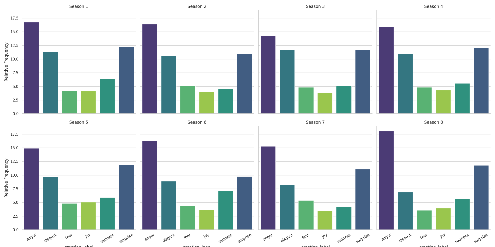
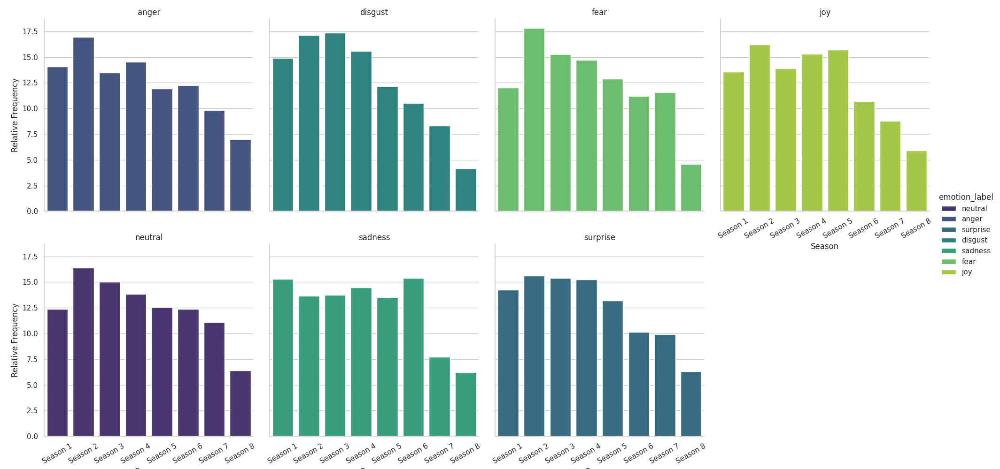

```{=latex}
\begin{center}
```
\ 

# Assignment 4

# Emotion analysis with pretrained language models

\
*Date: 18/04/2024*

Laura Givskov Rahbek 
```{=latex}
\end{center}
```
\

## Description 

This folder contains assignment 4 for Language Analytics. The objective of the assignment is to use pretrained language models via HuggingFace, to extract meaningful structured information from unstructured text data, and to interpret and contextualize these results. More specifically, a finetuned model will be used to predict emotion scores for each line of text in the dataset (the dataset contains all lines spoken on Game of Thrones, for more see the Data section below), in the seven emotion categories; anger, disgust, fear, joy, neutral, sadness and surprise. The emotion category with the highest score will be extracted, and finally a plot will allow for visual inspection of the profile and development in the emotions of Game of Thrones across the eight seasons it ran. 

The model used can be found [here](https://huggingface.co/j-hartmann/emotion-english-distilroberta-base), and is a pretrained DistilRoBERTa-base model, finetuned on emotion-data. Details on the training data etc can be found at the link above. 

The ```classify_emotions.py``` script does the following: 

- Loads in the ```j-hartmann/emotion-english-distilroberta-base``` classifier.  

- Loads in the ```Game_of_Thrones_Scripts.csv``` dataset.  

- Runs the classifier on each sentence in the dataset and returns the emotion label with the highest score, as well as this labels score. The resulting dataframe is saved to the ```out``` folder. 

The ```plot_emotions.py``` script does the following: 

- Takes argument *neutral* (-n), either rm_neut (remove neutral) or w_neut (with neutral), to dictate whether the plots should include the 'neutral' label. The neutral label was found to be much more prominent than the other labels, making it difficult to viually inspect the other labels in the plot, why this option was included. 

- Loads in the data saved by ```classify_emotions.py```.  

- Calculates the relative frequency of each emotion label per season and across the whole eight seasons. This results in two dataframes; one where the relative frequency of each emotion label, grouped by season will equal 100 and one where the relative frequency of each emotion label summed across seasons will equal 100.   

- The two different relative frequency calculations will each be plotted and saved to the ```out``` folder. 


## Data 

The data used in this assignment can be found [here](https://www.kaggle.com/datasets/albenft/game-of-thrones-script-all-seasons?select=Game_of_Thrones_Script.csv). It is a .csv file containing every line in the scripts for the eight seasons of Game of Thrones. The .csv file also contains information on the season and episode the line was said, as well as which character said the line. 

## Usage and Reproducing of Analysis 

To reproduce the analysis: 

- Download the dataset from the source described above, and place it in the ```in``` folder, as ```GoT-scripts/Game_of_Thrones_Script.csv```.  

- Run ```bash setup.sh``` from the command line, it creates a virtual environment and installs packages and dependencies in to it.   

- Enter the virtual environment by writting ```source ./env/bin/activate``` in the terminal. 

- Extract the emotion labels from each sentence in the dataset, by running ```python src/classify_emotions.py```.  

- Visualize the results without the neutral label by running:
    
```
python src/plot_emotions.py -n rm_neut
```

- Or alternatively with the neutral label: 

```
python src/plot_emotions.py -n rm_neut
```

- Finally to exit the virtual environment write ```deactivate``` in the termminal. 


## Discussion

The immidiate visuzalization of the emotional profile of Game of Thrones, shows a very large amount of neutral lines across all seasons. Above 40% of lines i all eight seasons had the highest score in the label neutral. A further analysis, would be able to shed light on whether many of these lines might have had another emotion label as prominent also, but as the neutral emotion is very similar across seasons, and obscures visual inspection of the other emotions, plots without neutral label was also made. The plot including the neutral label can be found [here](https://github.com/lrahbek/cds-lang-assignments/blob/main/assignment-4/out/Season_subplot_w_neut.png) and the plot were the neutral label has been excluded can be seen below; 
\

```{=latex}
\begin{center}
```
***Relative Frequency of each Emotion in each Season***

 
```{=latex}
\end{center}
```

When inspecting the plots, where the neutral emotion label have been removed, the seasons, in general, are very alike. The primary emotions across all seasons are anger and surprise. Anger in season 8 is the highest followed by season 1. The emotion with the most visible tendency is disugst, which falls steadily with season number. Sadness in season 1 and season 6 are slighlty higher than for the other seasons. Interestingly, the relative frequency of joy and fear are very alike, both around 5% across all seasons. Joy is at its highest in season 4 and fear is at its highest in season 7.
\

```{=latex}
\begin{center}
```
***Relative Frequency of each Emotion across all Seasons ***


```{=latex}
\end{center}
```

The second plot show the relative frequency of each emotion label in the entire series, as seen above. 


A further inspection, could include an episode wise timeseries for each season or the scores for each emotion. 
 
\
*```codecarbon``` was used to track the environmental impact when running this code, the results and an exploration of this can be found in the ```Assignment-5``` folder in the repository.*
